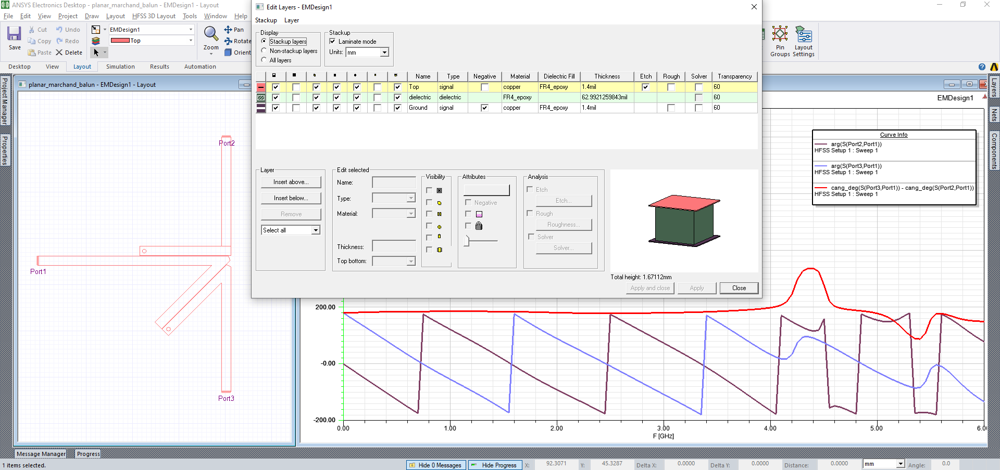
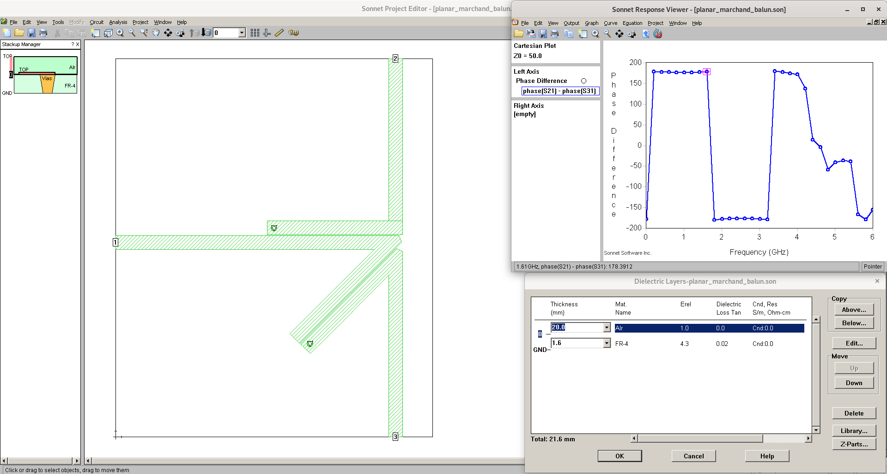

# planar_marchand_balun
A simple planar Marchand balun implementation in Ansys and Sonnet EM tools

Credit: 
1. [Marchand balun schematics simulation](https://github.com/promach/marchand_balun)
2. Edaboard and eevblog forums provide help in EM simulation

Note: 
1. The current planar Marchand balun implementation works only up to 4GHz. For larger bandwidth, we need to implement [A 0.8–8 GHz Multi-Section Coupled Line Balun](https://sci-hub.tw/10.3390/electronics4020274) instead.
2. Sonnet EM tool does not have phase angle unwrap() function implemented yet, so we see 180 degree and -180 degree sudden jump

TODO : 
1. Add isolation circuits between port 2 and port 3 for the purpose of perfect matching
2. Derive all the marchand balun equations from the paper : [New Design Formulas for Impedance-Transforming 3-dB Marchand Baluns](https://sci-hub.tw/10.1109/tmtt.2011.2164618)
3. Actual PCB fabrication and S-Parameter testing using Vector Network Analyzer
